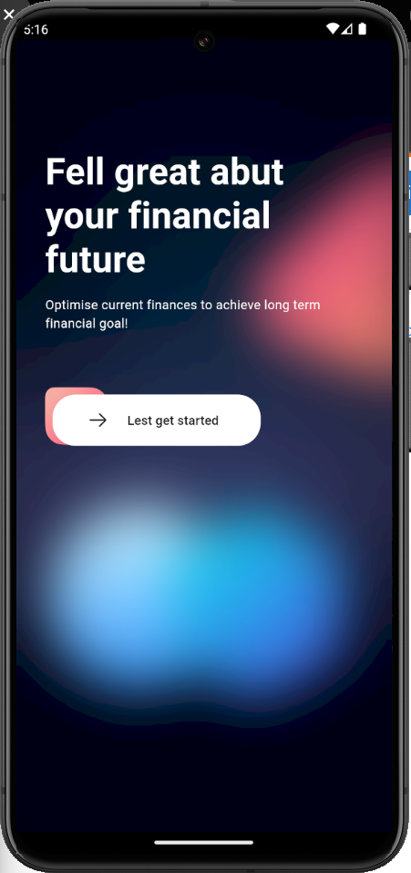

<h1 align="center">Onboarding Mobile with Flutter and Rive</h1>

   
  

   

## 📱 Screenshots

  

## ⚙️ Built with Amazing Tools

- [Flutter](https://flutter.dev/) - Beautiful native apps in record time.
- [Android Studio](https://developer.android.com/studio/index.html/) - Tools for building Awesome apps on every type of Android device.
- [Visual Studio Code](https://code.visualstudio.com/) - Code editing. Redefined.
